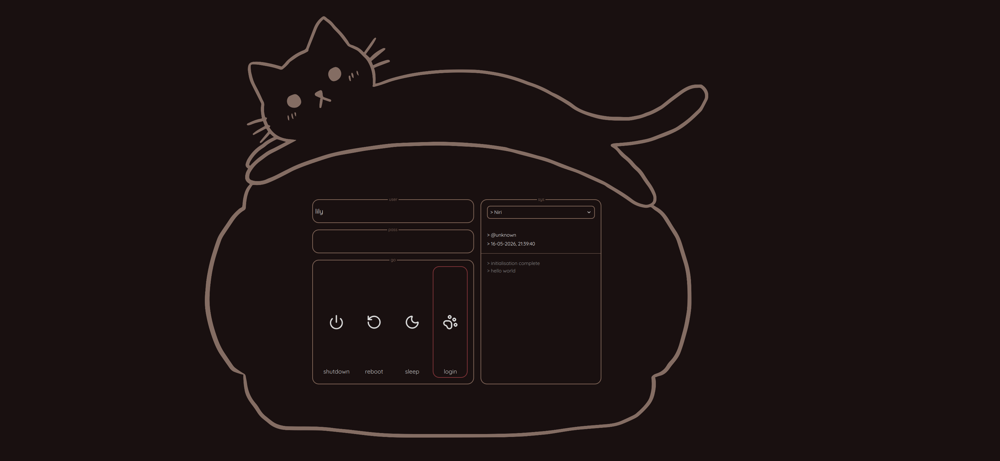

# loafiesgreeter

A minimalist SDDM greeter powered by Qt/QML and loafing cats.




## Status

> Current version: `0.1.0`

Experimental and under active development.  
Not yet packaged or considered stable.

## Dependencies

| Package | Purpose |
|---------|---------|
| `sddm` | Display manager |
| `qt5-base` | Qt5 runtime |
| `qt5-declarative` | QML engine |
| `qt5-quickcontrols2` | ComboBox, TextField etc. |
| `qt5-graphicaleffects` | ColorOverlay for icon/image tinting |

On Arch-based distros:
```bash
sudo pacman -S sddm qt5-base qt5-declarative qt5-quickcontrols2 qt5-graphicaleffects
```

## Installation

No installation instructions at this time. This project is not packaged or ready for general use.

## Related Projects

- [loafies](https://github.com/Lily123xoxo/loafies): A WIP Quickshell configuration I am still working on. It is in very early days...

## Credits
- Icons: [Lucide](https://lucide.dev)
- Stretching cat-frame: [Vecteezy](https://www.vecteezy.com/free-vector/cat-loaf)

## Inspirations
- https://github.com/maxchennn/vroomies
